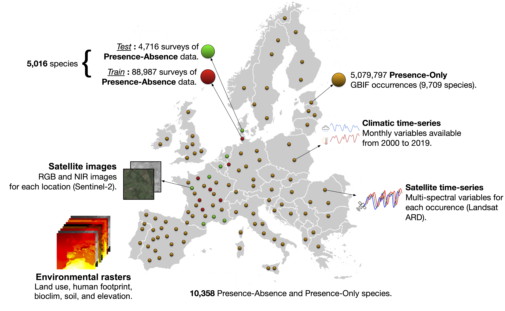

<div align="center">
<hr>
<a href="https://plantnet.github.io/GeoPlant/"></a>
<a href="https://papers.nips.cc/paper_files/paper/2024/hash/e4e7de47202bda8133dd3e8b46205cf2-Abstract-Datasets_and_Benchmarks_Track.html"></a>
<a href="https://arxiv.org/abs/2408.13928"></a>
<a href="https://huggingface.co/collections/BVRA/geoplant-673da70e19bd21268a0f39a2"></a>
<a href="https://www.kaggle.com/datasets/picekl/geoplant"></a>
<br><br>
</div>

> [!NOTE]
> **What's new in the GeoPlant ecosystem**
> * **New downloader tool.** Python and CLI access for the newly structured dataset, so you can download only the components you need. See [`dataset/README.md`](dataset/README.md).
> * **Data refreshed and fixed.** The update adds 30m OpenStreetMap-derived Human Footprint rasters, corrected/re-extracted SoilGrids values, and upgraded Sentinel-2 TIFF patches with RGB+NIR bands.
> * **New evaluation protocols.** GeoPlant now includes IID, OOD, and GLC25 presence-absence test sets, with leaderboards designed to measure spatial generalization and rare-species performance.

## 🌿 Welcome to the GeoPlant Dataset Hub! 🌍

**GeoPlant** is a large-scale, multimodal dataset for spatial plant species prediction across Europe.  
It integrates expert-verified species observations with rich environmental predictors and enables research, benchmarking, and applications in biodiversity, earth observation, and deep learning.

###   

**Figure 1.** *GeoPlant combines 5M Presence-Only and 90k Presence-Absence records with Sentinel-2 imagery, Landsat time series, CHELSA climate, and environmental rasters for 10k+ European plant species.*

## 🚀 Quick Start

- **[Dataset Overview](https://plantnet.github.io/GeoPlant/dataset/):** Learn about provided presence–absence and presence–only species data.  
- **[Environmental Predictors](https://plantnet.github.io/GeoPlant/environmental_predictors/):** Explore different variables, e.g., satellite imagery, time series, climate, soil, land cover, and human footprint.  
- **[Baselines & Benchmarking](https://plantnet.github.io/GeoPlant/baselines/):** See benchmark tasks, metrics, and baseline models.  
- **[Resources & Download](https://plantnet.github.io/GeoPlant/resources/):** Links to Kaggle, Seafile, Hugging Face, and the NeurIPS 2024 paper.  

---

## Download

See the downloader guide in [`dataset/README.md`](dataset/README.md).

---

## 🔎 Key Resources

| Resource                  | Description                                                     | Link                                                                                                                                                      |
|---------------------------|-----------------------------------------------------------------|-----------------------------------------------------------------------------------------------------------------------------------------------------------|
| 📄 **Dataset Paper**      | NeurIPS 2024 proceedings paper (Datasets & Benchmarks track)   | [Proceedings](https://papers.nips.cc/paper_files/paper/2024/hash/e4e7de47202bda8133dd3e8b46205cf2-Abstract-Datasets_and_Benchmarks_Track.html) |
| 📄 **Extended Version**   | arXiv preprint with supplementary details                      | [arXiv:2408.13928](https://arxiv.org/abs/2408.13928) |
| 🚀 **Starter Notebooks**  | Baseline models, pipelines, and scripts                        | [GeoPlant Code on Kaggle](https://www.kaggle.com/datasets/picekl/geoplant/code)                                                                           |
| 📦 **Full Dataset**       | Full data including PO and environmental rasters               | [GeoPlant Seafile](https://lab.plantnet.org/seafile/d/59325675470447b38add/)                                                                              |
| 🤗 **Pretrained Models**  | Hugging Face collection of baselines                           | [Hugging Face](https://huggingface.co/collections/BVRA/geoplant-673da70e19bd21268a0f39a2)                                                                 |

---

## 🔀 Active Branches
| Branch                     | What’s inside                                                                                 |
|----------------------------|-----------------------------------------------------------------------------------------------| |
| `dev`                      | Refactoring and better accessibility.                                              |
| `docs`                     | Sources for the website documentation.                                                        |


## 📜 Citation

If you use GeoPlant, please cite the NeurIPS proceedings:

**NeurIPS 2024 (Datasets & Benchmarks Track)**
```bibtex
@inproceedings{picek2024geoplant_neurips,
  title     = {GeoPlant: Spatial Plant Species Prediction Dataset},
  author    = {Picek, Lukas and Botella, Christophe and Servajean, Maximilien and Leblanc, C{\'e}sar and Palard, R{\'e}mi and Larcher, Th{\'e}o and Deneu, Benjamin and Marcos, Diego and Bonnet, Pierre and Joly, Alexis},
  booktitle = {NeurIPS 2024 Datasets and Benchmarks Track},
  year      = {2024}
}
```

## 🙋 Support

- Issues & feature requests: [GitHub Issues](https://github.com/plantnet/GeoPlant/issues)
- Kaggle discussion: [GeoPlant on Kaggle](https://www.kaggle.com/datasets/picekl/geoplant/discussion)
