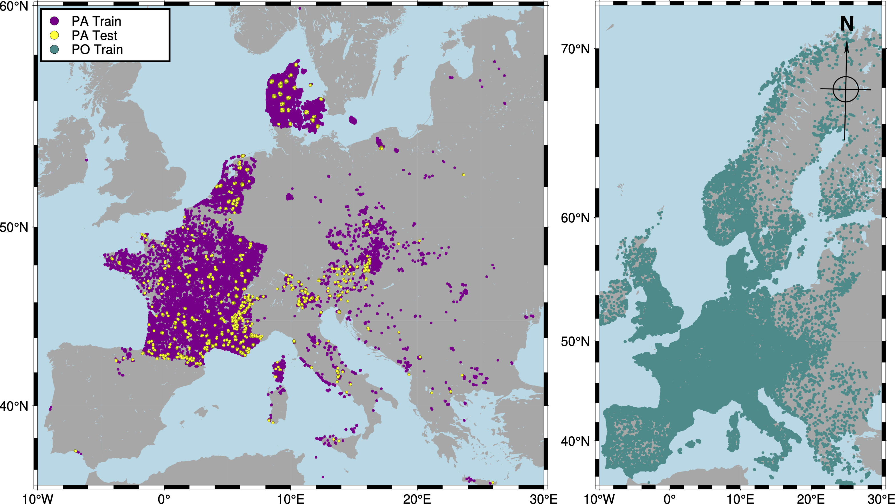

# GeoPlant Dataset

The **GeoPlant** dataset comprises *Species Observation* data (i.e., **Presence-Only (PO)** occurrences and **Presence-Absence (PA)** surveys) and a wide set of *Environmental Predictors*. It covers 38 European countries and 8 major biogeographic regions (e.g., Alpine, Atlantic, and Boreal).

For each species observation, we provide:

- Diverse **environmental rasters** (e.g., elevation, human footprint, land use, soil)
- Sentinel-2 **RGB and Near-Infra-Red satellite images** (128×128 pixels at 10 m resolution)
- A **20-year time series of climatic variables**
- **Satellite time-series point values** for six bands (R, G, B, NIR, SWIR1, SWIR2) from Landsat

> *For a detailed description of all predictor modalities, see the [Predictors & Modalities](predictors.md) page.*

###   
**Figure 1. Geo spatial scale of the dataset.** *Presence-Only (PO) data spans all habitable Europe, while Presence-Absence (PA) training and test sites are primarily in France, Denmark, Switzerland, and Czechia.*

---

## Species Observation Data

The dataset contains approximately **5M PO occurrences** and around **90K PA surveys**.

PO data covers most of Europe, but is sampled opportunistically without a standardized protocol, leading to various biases. Local observation of a species does **not** guarantee other species are truly absent. PA surveys are conducted by experts and provide much more reliable information.

### Presence-Absence (PA) surveys

A PA survey is an expert inventory of all plant species in a given plot (10–400 m²). All unobserved species are likely truly absent. 

- **Source:** 29 datasets hosted in the [European Vegetation Archive (EVA)](https://euroveg.org/eva-database/)
- **Size:** 93,703 surveys covering 5,016 species (≈ half of the European flora)
- **Imbalance:** Most species are rarely observed in PA surveys.
- **Train/Test Splits:** 95%/5% using spatial block hold-out (10×10 km grid) to balance biogeographical regions.

### Presence-Only (PO) occurrences

A PO occurrence is a geolocated species observation with unknown sampling protocol, providing no info on species absences. Sampling effort is highly heterogeneous in space, time, and across species—most PO records come from citizen science, are concentrated in accessible/populated areas, and focus on charismatic/easy species. Nevertheless, PO data helps compensate for PA survey gaps when models control for sampling bias.

- **Size:** ~5 million records for 9,709 plant species (2017–2021)
- **Source:** 13 pre-selected datasets from [GBIF](https://www.gbif.org/)

**Table 1. Presence-Only dataset sources** *Selected GBIF datasets cover 38 European countries. "Uniq. species" indicates the number of unique species in each dataset compared to the rest.*

| GBIF Dataset Name | Records | Species | Uniq. species |
|:---|---:|---:|---:|
| [Pl@ntNet Observations](https://www.gbif.org/dataset/7a3679ef-5582-4aaa-81f0-8c2545cafc81) + [Pl@ntNet Occurrences](https://www.gbif.org/dataset/14d5676a-2c54-4f94-9023-1e8dcd822aa0) | 2,298,884 | 4,631 | 295 |
| [Danmarks Miljøportals Naturdatabase](https://www.gbif.org/dataset/67fabcac-a638-40a6-9bea-aeca8aced9f1) | 691,313 | 1,457 | 14 |
| [iNaturalist Research-grade Observations](https://www.gbif.org/dataset/50c9509d-22c7-4a22-a47d-8c48425ef4a7) | 625,681 | 7,496 | 1,754 |
| [Norwegian Species Observation Service](https://www.gbif.org/dataset/b124e1e0-4755-430f-9eab-894f25a9b59c) | 601,101 | 2,243 | 167 |
| [Observation.org](https://www.gbif.org/dataset/8a863029-f435-446a-821e-275f4f641165) | 241,205 | 5,108 | 429 |
| [Non-native plant occurrences in Flanders/Brussels](https://www.gbif.org/dataset/7f5e4129-0717-428e-876a-464fbd5d9a47) | 178,544 | 1,464 | 134 |
| [Artportalen (Swedish Species Observation System)](https://www.gbif.org/dataset/38b4c89f-584c-41bb-bd8f-cd1def33e92f) | 163,513 | 2,771 | 464 |
| [National Plant Monitoring Scheme U.K.](https://www.gbif.org/dataset/9a6bdcc9-e017-44ea-9cf9-ff6a87fdb8c2) | 120,413 | 1,109 | 11 |
| [Vascular plant records via iRecord](https://www.gbif.org/dataset/0a013f89-5381-4578-9d82-5f28fd5f1ef6) | 103,213 | 2,179 | 99 |
| [Swiss National Databank of Vascular Plants](https://www.gbif.org/dataset/83fdfd3d-3a25-4705-9fbe-3db1d1892b13) | 49,173 | 58 | 2 |
| [Invazivke - Invasive Alien Species in Slovenia](https://www.gbif.org/dataset/ebf3c079-f88e-4b85-bcc5-f568229e68f3) | 4,171 | 60 | 1 |
| [Masaryk University - Herbarium BRNU](https://www.gbif.org/dataset/54f946aa-2ca9-4a51-9ee5-011219e0381e) | 2,586 | 1,321 | 122 |
| **GeoPlant PO data (Combined)** | 5,079,797 | 9,709 | --- |

## Environmental Predictors

The environmental predictor data are crucial for modeling.  
Each observation (PO or PA) is accompanied by:

- A **4-band 128×128 satellite image at 10 m** resolution (Sentinel-2)
- **Time series of 6 satellite bands** (Landsat; R, G, B, NIR, SWIR1, SWIR2; 1999–2020)
- **Environmental rasters** at European scale: climate, soil, elevation, land use, human footprint
- **Monthly climatic rasters** (CHELSA; 4 variables, 2000–2019)

> **For full details and variable lists, see the [Predictors & Modalities](predictors.md) page.**

---

*For data download and file structure, see the [Resources](resources.md) page.*  
*Please cite the GeoPlant paper if you use or redistribute this dataset.*

