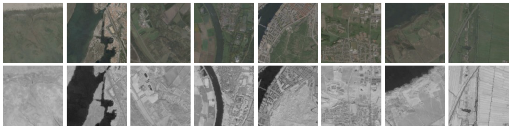
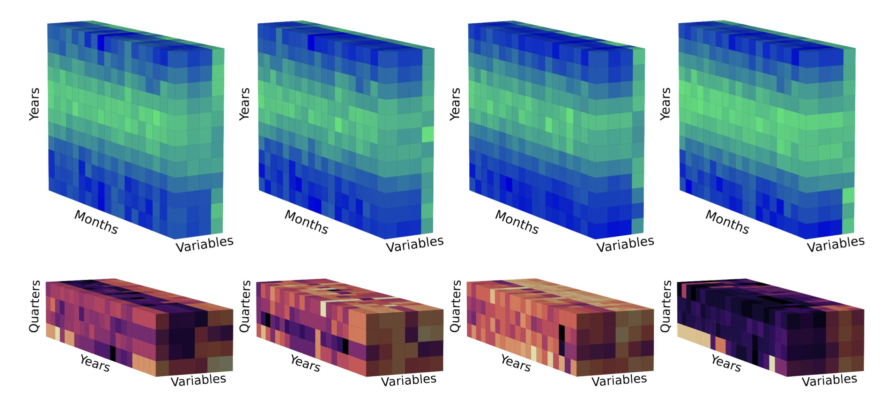

# Environmental Predictors & Modalities

**GeoPlant pairs every species observation with a set of environmental predictors; crucial for fine-grained, multimodal species distribution modeling. These predictors capture environmental context at both local and continental scale.**

---

## Overview

Each Presence-Only (PO) or Presence-Absence (PA) observation is provided with:

1. A four-band 128×128 satellite image at 10 m resolution centered on the observation location.
2. Time series of the past values for six satellite bands at the point location.
3. Diverse environmental rasters at European scale (climatic, soil, elevation, land cover, and human footprint).
4. Monthly time series of four climatic variables (2000–2019).

The dataset combines multiple sources, formats, and preprocessing steps to provide unified, observation-level predictors.

---

## Environmental Rasters

We associate every observation with a rich set of **environmental rasters**, including:

- **19 bioclimatic rasters** (CHELSA)
- **9 soil rasters** (SoilGrids)
- **High-resolution elevation raster** (ASTER GDEM)
- **Medium-resolution, multi-band land cover raster** (MODIS)
- **16 human footprint rasters** (Venter et al., with both summary and detailed layers)

All rasters are distributed as GeoTIFF files (WGS84, EPSG:4326), aligned to the same spatial extent (min_x, min_y) = (-32.26, 26.63), (max_x, max_y) = (35.58, 72.18), and pre-extracted as scalar values for each observation.

---

### Land Cover

- **Source:** MODIS Terra+Aqua (MCD12Q1) via NASA Earthdata
- **Resolution:** ~500 m, multi-band (13 layers: land cover classes and confidence)
- **Description:** Each band represents a land cover class prediction (e.g., IGBP-17, LCCS-43) or confidence. Land cover variables are powerful predictors at all scales, improving bioclimatic SDM performance.  
- **Format:** Multi-band GeoTIFF and CSV  
- **Access:** `/EnvironmentalRasters/LandCover/`
- **Reference:** [MODIS User Guide](https://lpdaac.usgs.gov/documents/101/MCD12_User_Guide_V6.pdf)

---

### Human Footprint

- **Source:** [Venter et al., 2016](https://datadryad.org/stash/dataset/doi:10.5061/dryad.052q5)
- **Resolution:** 1 km
- **Description:**
    - 16 low-resolution rasters: 14 detailed pressures (seven pressures × two time periods: 1993/2009), and two summary rasters.  
    - Pressures include: nightlights, population density, built environment, electrical infrastructure, cropland, pastureland, roads, railways, navigable waterways. Scores are normalized by biome for comparability.
- **Format:** GeoTIFF and CSV  
- **Access:** `/EnvironmentalRasters/HumanFootprint/`

---

### Elevation

- **Source:** [ASTER Global Digital Elevation Model V3](https://lpdaac.usgs.gov/products/astgtmv003/)
- **Resolution:** 30 m
- **Description:** Topography is a major factor in plant distributions. Provided as both a raster (GeoTIFF) and CSV of values at each observation.
- **Access:** `/EnvironmentalRasters/Elevation/`

---

### SoilGrids

- **Source:** [SoilGrids](https://soilgrids.org/)
- **Resolution:** 1 km (aggregated from 250 m)
- **Variables:** 9 soil properties (e.g., pH, clay, organic carbon, nitrogen) at 5–15 cm depth
- **Description:** Soil is essential for modeling plant species ranges. Provided as GeoTIFFs (WGS84) and CSV.
- **Access:** `/EnvironmentalRasters/Soilgrids/`

---

## Satellite Images

**Sentinel-2 RGB and NIR satellite images** offer high-resolution local context for each observation.

- **Patch size:** 128 × 128 pixels (1.28 km × 1.28 km)
- **Resolution:** 10 m per pixel
- **Bands:** RGB (3-band, color JPEG) and NIR (1-band, grayscale JPEG)
- **Source:** [Ecodatacube](https://stac.ecodatacube.eu/)
- **Processing:** Images are cloud- and shadow-free composites from the same year as the observation. Pixel values are thresholded at 10,000, rescaled [0,1], gamma corrected (power 1/2.5), and finally mapped to [0,255] uint8.

  
**Figure 1:** *128×128 Sentinel-2 patches. Top: RGB, Bottom: NIR.*

---

## Satellite Time Series

**Landsat time series** add 21 years of quarterly surface reflectance at each location.

- **Bands:** R, G, B, NIR, SWIR1, SWIR2
- **Seasons:** 1999–2020 (84 steps)
- **Format:** CSV per band (one row per observation), plus 3D tensors [BAND, QUARTER, YEAR]
- **Processing:** Median point values per season, extracted and aggregated for all locations. Enables temporal modeling of vegetation change, fire, land use, etc.

  
**Figure 2:** *Top row—19 years of 4 monthly climate variables; Bottom row—21 years of quarterly satellite band values for selected surveys.*

---

## Climatic Variables

**CHELSA climate data** offers both monthly and long-term summary variables.

- **Monthly:** 4 variables (mean/min/max temperature, precipitation) from Jan 2000–Dec 2019 (960 rasters)
- **Averages:** 19 “bioclim” variables averaged over 1981–2010 (e.g., mean annual temperature, precipitation seasonality)
- **Resolution:** 1 km (30 arcsec)
- **Format:** GeoTIFF and CSV, plus 3D tensors [RASTER-TYPE, YEAR, MONTH]
- **Access:** `/EnvironmentalRasters/Climate/`

---

## Data Access and Format

All predictors are pre-extracted for each PO/PA observation:

- **Scalar values:** CSVs (per observation).
- **Images:** JPEG (RGB/NIR), named by survey ID.
- **Time series:** CSV and tensor files.
- **Full rasters:** Available via Seafile for custom extraction.

For file structure, download instructions, and sample code, see the [Resources](resources.md) page.

---

*Return to [Dataset Overview](dataset.md) or continue to [Baselines & Benchmarking](baselines.md) for modeling results.*
