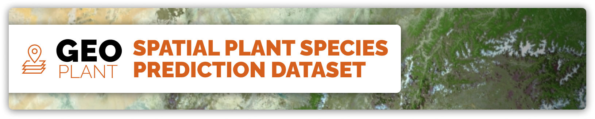

 <b> 🚧This documentation is under construction. We will produce updates aprox. once a week. 🚧</b>

  

# 🌿 Welcome to the GeoPlant Dataset Hub! 🌍
**GeoPlant** is a large-scale, multimodal dataset for spatial plant species prediction across Europe, combining expert-verified species observations with rich environmental context. It enables research, benchmarking, and applications in biodiversity, earth observation, and deep learning.

###   

**Figure 1.** *GeoPlant integrates over 5 million Presence-Only and 90,000 Presence-Absence records for 10,000+ European plant species, each linked with high-resolution satellite imagery, long-term climate and Landsat time series, and diverse environmental predictors. All data and benchmarks are openly available for SDM research.*

---

## 🚀 Quick Start

- **[Dataset Overview](dataset.md):** Learn about provided presence-absence and presence-only species data.

- **[Environmental Predictors](environmental_predictors.md):** Explore different variables, e.g., satellite imagery, time series, climate, soil, land cover, and human footprint.

- **[Baselines & Benchmarking](baselines.md):** See benchmark tasks, metrics, and baseline models.

- **[Resources & Download](resources.md):** Get links to Kaggle, Seafile, code, and the NeurIPS 2024 paper.

---

## 🔎 Key Resources

| Resource                  | Description                                                     | Link                                                                                                                                                      |
|---------------------------|-----------------------------------------------------------------|-----------------------------------------------------------------------------------------------------------------------------------------------------------|
| 📄 **Dataset Paper**      | NeurIPS 2024 paper detailing the dataset and benchmark          | [NeurIPS Paper (PDF)](https://proceedings.neurips.cc/paper_files/paper/2024/file/e4e7de47202bda8133dd3e8b46205cf2-Paper-Datasets_and_Benchmarks_Track.pdf) |
| 🧠 **GitHub Repository**  | Codebase with data loaders, baseline models, and utilities      | [GeoPlant Repo](https://github.com/plantnet/GeoPlant)                                                                                                     |
| 🚀 **Starter Notebooks**  | Baseline models, pipelines, and scripts                        | [GeoPlant Code on Kaggle](https://www.kaggle.com/datasets/picekl/GeoPlant/code)                                                                           |
| 📦 **Full Dataset**       | Full data including PO and environmental rasters               | [GeoPlant Seafile](https://lab.plantnet.org/seafile/d/59325675470447b38add/)                                                                              |